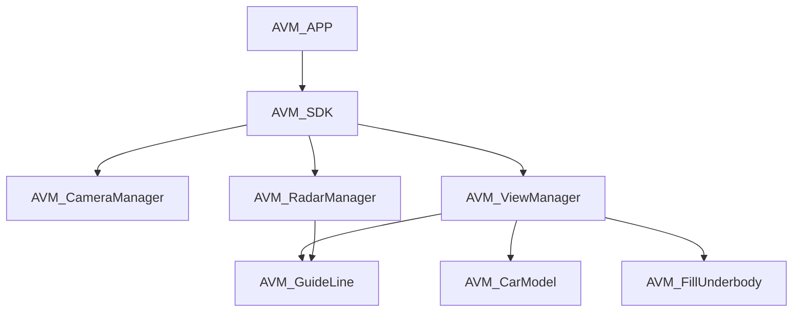
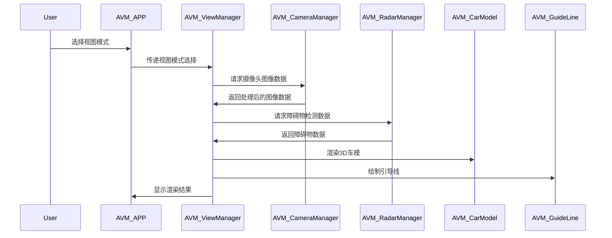

### 1. 软件结构

#### 1.1. 模块标识

AVM系统的软件结构主要由多个功能模块组成，每个模块均有其独特的标识符。模块的标识符通常遵循以下命名约定：`AVM_<模块名称>`。主要模块包括但不限于：

- `AVM_APP`: AVM应用控制模块
- `AVM_SDK`: AVM图像处理及渲染模块
- `AVM_CameraManager`: 摄像头数据管理模块
- `AVM_RadarManager`: 雷达数据处理模块
- `AVM_ViewManager`: 视图显示及切换模块
- `AVM_CarModel`: 3D车模显示模块
- `AVM_GuideLine`: 引导线显示模块
- `AVM_FillUnderbody`: 车底填充模块

#### 1.2. 模块概述

AVM系统模块化设计，将系统功能拆分为独立的模块，每个模块负责一个或多个特定功能，保证系统的高效性、可维护性和扩展性。

##### 1.2.1. 功能概述

1. **AVM_APP模块**: 提供用户界面，控制AVM系统的进入和退出，负责与用户交互及功能设置。
2. **AVM_SDK模块**: 核心图像处理模块，负责将各摄像头数据进行拼接、畸变矫正、3D建模和渲染，输出实时的全景影像。
3. **AVM_CameraManager模块**: 负责从车辆周围多个摄像头采集图像数据，并进行数据的预处理（如去噪、白平衡、亮度调节）。
4. **AVM_RadarManager模块**: 负责超声波雷达数据的采集、分析和融合，检测障碍物并生成雷达弧段及距离提示。
5. **AVM_ViewManager模块**: 负责不同视图模式的切换（如2D俯视、3D视角、环视模式），并根据用户选择的模式渲染不同的显示内容。
6. **AVM_CarModel模块**: 负责3D车模的创建、渲染和显示，支持车模的颜色切换、透明度调整、动画和旋转。
7. **AVM_GuideLine模块**: 实现根据车辆方向盘角度计算动态引导线并显示在相应的视图中。
8. **AVM_FillUnderbody模块**: 在车模透明模式下，通过摄像头图像和环境数据进行车底填充，模拟显示车辆下方的环境信息。

##### 1.2.2. 静态结构图

静态结构图展示了AVM系统软件各模块之间的静态关系，模块之间的调用和依赖关系。结构图通常包括各模块的接口、输入输出、数据流及相互之间的调用关系。

#### 1.3. 模块的输入/输出

每个模块通过输入和输出接口与其他模块或系统交互，具体接口信息如下：

##### 1.3.1. 输入接口列表

- **AVM_APP模块**: 用户操作（触摸屏点击、手势控制、语音指令等）
- **AVM_SDK模块**: 车载摄像头数据、雷达数据、方向盘转角传感器数据、车辆速度等
- **AVM_CameraManager模块**: 车载摄像头的原始图像数据
- **AVM_RadarManager模块**: 超声波雷达的探测距离数据
- **AVM_ViewManager模块**: 用户选择的视图模式、视角角度等
- **AVM_CarModel模块**: 车辆状态信息、用户设置的车模颜色和透明度等
- **AVM_GuideLine模块**: 方向盘转角数据、车辆速度和位置信息等
- **AVM_FillUnderbody模块**: 摄像头图像数据、车辆位置信息等

##### 1.3.2. 输出接口列表

- **AVM_APP模块**: 提供AVM系统的可视化控制界面，显示AVM图像
- **AVM_SDK模块**: 全景影像数据、渲染图像
- **AVM_CameraManager模块**: 预处理后的图像数据
- **AVM_RadarManager模块**: 障碍物信息、雷达弧段数据
- **AVM_ViewManager模块**: 渲染的2D/3D视图
- **AVM_CarModel模块**: 渲染的3D车模
- **AVM_GuideLine模块**: 动态引导线显示数据
- **AVM_FillUnderbody模块**: 车底填充影像数据

#### 1.4. 子模块清单（OPTIONAL）

每个模块内部可以包含多个子模块，例如，`AVM_SDK模块`可分为图像拼接子模块、畸变矫正子模块、图像渲染子模块等。

#### 1.5. 数据结构（OPTIONAL）

描述各模块中使用的数据结构，例如图像数据结构、障碍物检测数据结构、引导线数据结构等。

#### 1.6. 算法（OPTIONAL）

描述各模块中使用的核心算法，例如图像拼接算法、3D建模算法、深度学习目标检测算法、引导线计算算法等。

#### 1.7. 资源消耗情况（OPTIONAL）

列出各模块在执行过程中对CPU、内存、GPU、存储等资源的消耗情况，以便进行性能优化和资源调度。

### 2. 子模块设计（OPTIONAL）

子模块设计部分详细描述各主要模块的子模块结构，包括其功能、输入输出项和动态行为。

#### 2.1. XX模块

以下以`AVM_ViewManager`模块为例详细描述子模块设计：

##### 2.1.1. 功能概述

`AVM_ViewManager`模块负责显示AVM系统的2D和3D视图，并根据用户选择或传感器数据实时切换视图模式。它需要与图像处理模块、3D渲染模块、车模显示模块和引导线模块进行交互，以提供准确的车辆周围环境视图。

##### 2.1.2. 输入/输出项

###### 2.1.2.1. 输入项

- 用户选择的视图模式（2D俯视、3D视角等）
- 车载摄像头图像数据（通过`AVM_CameraManager`模块）
- 障碍物检测数据（通过`AVM_RadarManager`模块）

###### 2.1.2.2. 输出项

- 渲染的2D和3D车辆视图
- 更新的引导线显示数据
- 车模透明度和颜色显示信息

#### 2.2. 动态行为描述

`AVM_ViewManager`模块在接收到用户指令后，动态切换到相应的视图模式，并调用`AVM_CameraManager`、`AVM_RadarManager`、`AVM_CarModel`和`AVM_GuideLine`模块进行图像处理、渲染和数据显示。动态行为的序列图如下：

通过这种设计，AVM系统能够模块化地处理不同的输入和输出数据，确保系统的可靠性和易于维护性。